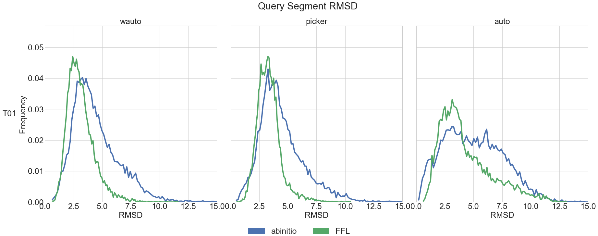
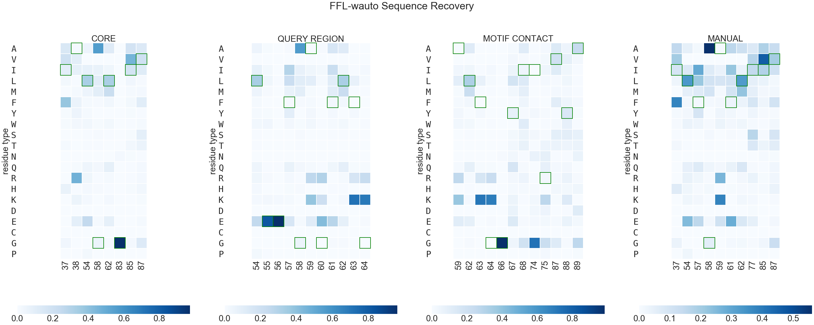
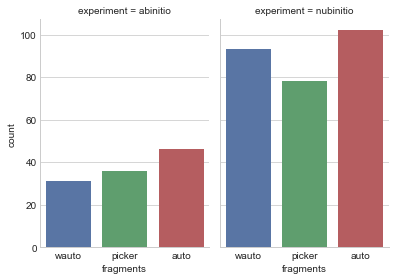

```python
# base libraries
import warnings; warnings.simplefilter('ignore')
import os
import sys

# external libraries
import matplotlib
import matplotlib.pyplot as plt
import pandas as pd
import seaborn as sns
from IPython.display import display_javascript, display_html, display

# local libraries
sys.path.append(os.path.abspath("../"))
import readme_utils


sns.set(font_scale=3)
matplotlib.rcParams['svg.fonttype'] = 'none'
pd.set_option('display.max_columns', None)
sns.set_style("whitegrid")
```

# Load baseline data for the Benchmark


```python
info = readme_utils.io.load_benchmark_info("_info.yaml")
readme_utils.plot.show_info(info)
```


<div style="width:100%;">
    <table style="width:60%;margin-left:20%">
        <tr style="border-top: 3px solid black;border-bottom: 1px solid black;">
            <th colspan="6" style="text-align:center;" >Benchmark</th>
        </tr>
        <tr>
            <th colspan="2" style="text-align:center;" >ID</th>
            <th colspan="2" style="text-align:center;" >CATH</th>
            <th colspan="2" style="text-align:center;" ># motifs</th>
        </tr>
        <tr>
            <td colspan="2" style="text-align:center;" >T01</td>
            <td colspan="2" style="text-align:center;" >CATH.3.40.140.10</td>
            <td colspan="2" style="text-align:center;" >1</td>
        </tr>
        <tr style="border-top: 3px solid black;border-bottom: 1px solid black;">
            <th colspan="6" style="text-align:center;" >Structures</th>
        </tr>
        <tr>
            <th colspan="3" style="text-align:center;" >Query</th>
            <th colspan="3" style="text-align:center;" >Reference</th>
        </tr>
        <tr>
            <td colspan="3" style="text-align:center;" >2pw9C.pdb</td>
            <td colspan="3" style="text-align:center;" >1pgxA.pdb</td>
        </tr>
        <tr style="border-top: 3px solid black;border-bottom: 1px solid black;">
            <th colspan="6" style="text-align:center;" >Design</th>
        </tr>
        <tr>
            <th colspan="2" style="text-align:center;" >motif</th>
            <th colspan="2" style="text-align:center;" >chain</th>
            <th colspan="2" style="text-align:center;" >sequence shift</th>
        </tr>
        <tr>
            <td colspan="2" style="text-align:center;" >69-73</td>
            <td colspan="2" style="text-align:center;" >C</td>
            <td colspan="2" style="text-align:center;" >32</td>
        </tr>
        <tr style="border-top: 3px solid black;">
            <th colspan="2" style="text-align:center;border-right: 1px solid black;" >Experiments</th>
            <td colspan="2" style="text-align:center;" >abinitio</td>
            <td colspan="2" style="text-align:center;" >nubinitio</td>
        </tr>
        <tr style="border-top: 3px solid black;border-bottom: 1px solid black;">
            <th colspan="6" style="text-align:center;" >Fragment types</th>
        </tr>
        <tr>
            <th colspan="1" style="text-align:center;" >auto</th>
            <td colspan="5" style="text-align:left;" >Automatic fragment generation (sequence + secondary structure)</td>
        </tr>
        <tr>
            <th colspan="1" style="text-align:center;" >picker</th>
            <td colspan="5" style="text-align:left;" >Standard Rosetta fragment generation (sequence-based data)</td>
        </tr>
        <tr>
            <th colspan="1" style="text-align:center;" >wauto</th>
            <td colspan="5" style="text-align:left;" >Automatic fragment generation (secondary structure + angles + sasa)</td>
        </tr>
    </table>
    </div>


```python
base = readme_utils.io.load_baseline(info)
base
```


<div>
<style scoped>
    .dataframe tbody tr th:only-of-type {
        vertical-align: middle;
    }

    .dataframe tbody tr th {
        vertical-align: top;
    }

    .dataframe thead th {
        text-align: right;
    }
</style>
<table border="1" class="dataframe">
  <thead>
    <tr style="text-align: right;">
      <th></th>
      <th>score</th>
      <th>lbl_CORE</th>
      <th>lbl_PICKED</th>
      <th>lbl_MOTIF</th>
      <th>lbl_QUERY</th>
      <th>sequence_C</th>
      <th>structure_C</th>
      <th>lbl_CONTACTS</th>
    </tr>
  </thead>
  <tbody>
    <tr>
      <th>0</th>
      <td>73.639</td>
      <td>6-7,23,27,31,52,54,56</td>
      <td>6,23,26-28,30-31,46,54,56</td>
      <td>38-42</td>
      <td>23-33</td>
      <td>ETPYAIALNDRVIGSSMVLPVDLEEFGAGFLFGQGYIKKAEEIREILVCPQGRISVYA</td>
      <td>LEEEEEEELLEEEEEEEELLLLHHHHHHHHHHHHLLLLLLLLLLLEEEELLLEEEELL</td>
      <td>28,31-33,35-37,43-44,56-58</td>
    </tr>
  </tbody>
</table>
</div>


# Fragment analysis


```python
print os.path.isfile("./fragments/2pw9C.auto.200.3mers")
fragments = readme_utils.io.load_fragments( info )
```

    True


```python
readme_utils.plot.plot_fragments( fragments, info, base )
```


# Main data analysis


```python
df = readme_utils.io.load_main_data( info, base )
```


```python
print "columns:", ", ".join([str(x) for x in df.columns.values]), "\n"
df.groupby(["experiment", "fragments"]).count()["description"]
```

    columns: score, ALIGNRMSD, BUNS, COMPRRMSD, C_ni_mtcontacts, C_ni_rmsd, C_ni_rmsd_threshold, C_ni_trials, MOTIFRMSD, cav_vol, driftRMSD, finalRMSD, packstat, C_ni_rmsd_type, description, experiment, fragments, sequence_C, benchmark 
    


    experiment  fragments
    abinitio    auto         10296
                picker       10296
                wauto        10296
    nubinitio   auto         10296
                picker       10296
                wauto        10296
    Name: description, dtype: int64


## Compare FFL vs. abinitio RMSD


```python
readme_utils.plot.plot_main_summary( df )
```


```python
readme_utils.plot.plot_main_distributions( df, 15 )
```





## FFL sequence retrieval


```python
readme_utils.plot.plot_aa_heatmaps( df, info, base, 0.1 )
```





```python
readme_utils.plot.plot_aa_similarities( df, info, base )
```


## Success?
We measure success over the top 10% scored decoys of each experiment/fragment type; comparing the performance of FFL vs. that of _abinitio_.


```python
readme_utils.plot.check_success(df, info, base, 0.1, 3.0)
```





```python

```
